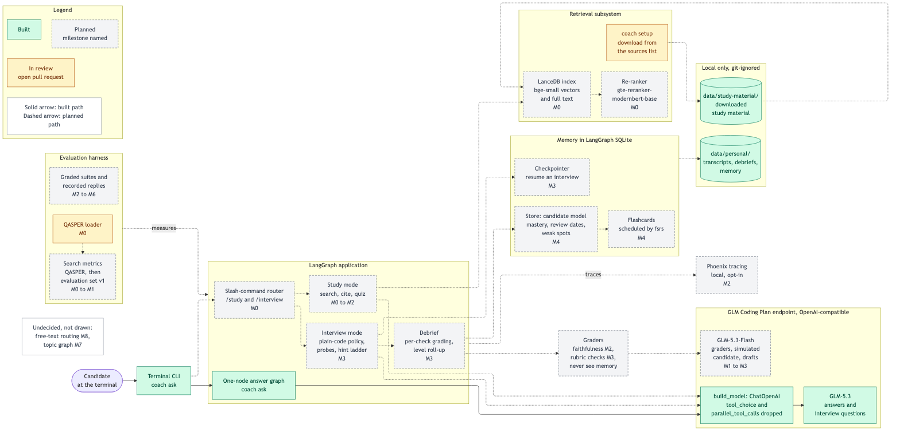
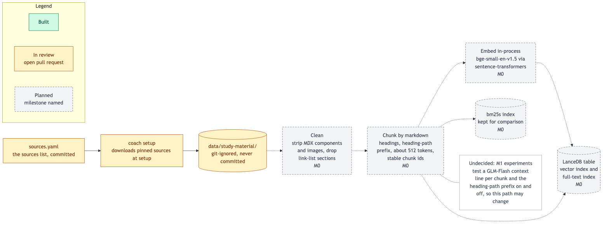
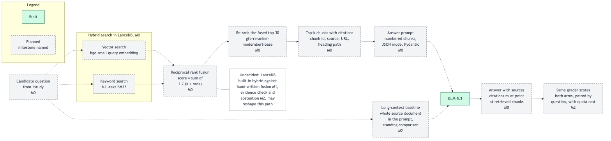
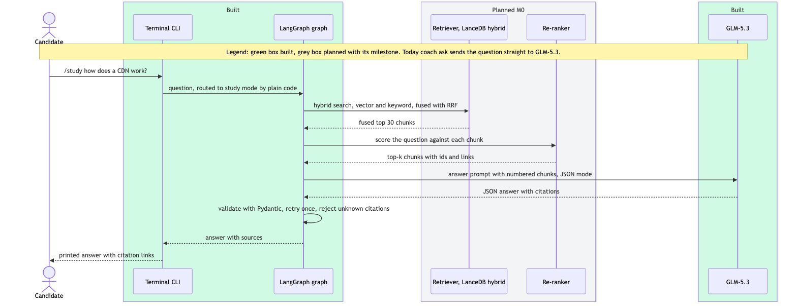
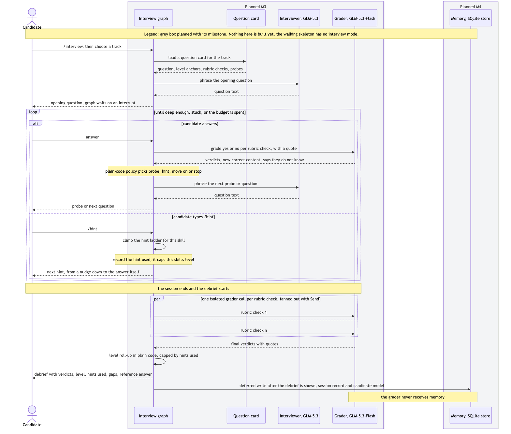
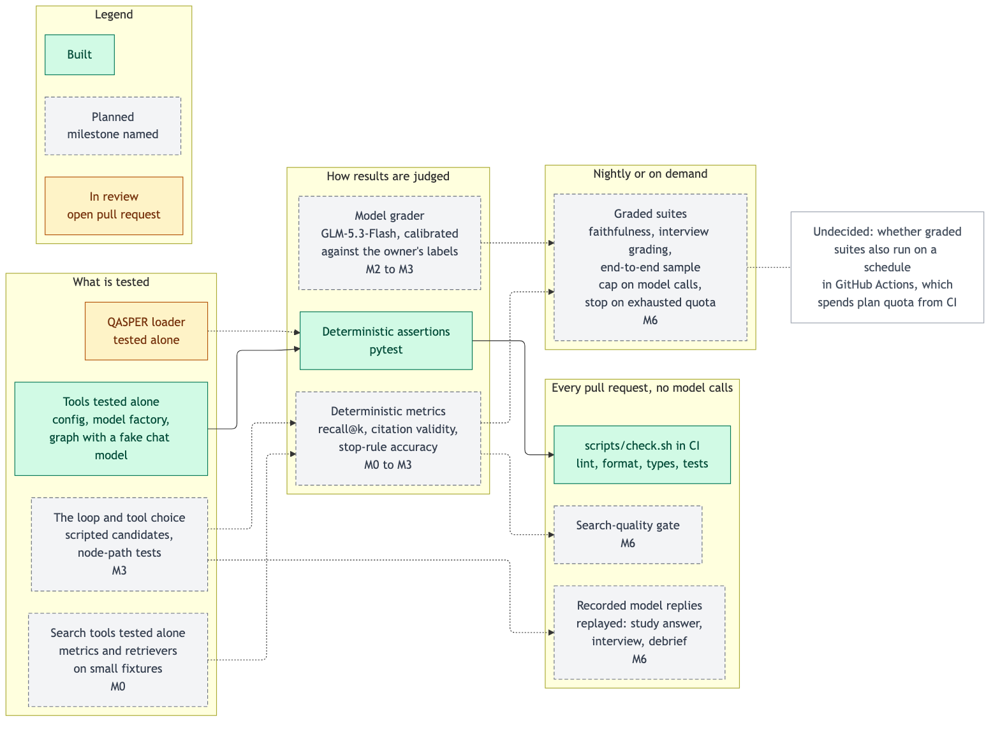

# Architecture

Six pictures of the whole planned system, drawn from [`CONTEXT.md`](../../CONTEXT.md)
and the decision records in [`docs/adr/`](../adr/). Each one marks what exists today:

- **Built** (green, solid border): merged into `master`. Today that is the walking
  skeleton, `coach ask` through a one-node LangGraph graph to GLM-5.3, plus the
  git-ignored local data folders.
- **In review** (amber): an open pull request, here the sources list with `coach setup`
  and the QASPER loader.
- **Planned** (grey, dashed border): not started, labelled with its milestone (M0 to M9,
  as in the GitHub milestones). Where a planned part's shape is still undecided, a white
  note says so instead of inventing detail.

## Editing a diagram

The `.mmd` files are [Mermaid](https://mermaid.js.org/) sources and the PNGs beside them
are exported from them. Rendering uses the mermaid-cli version pinned in
[`package.json`](../../package.json), installed locally by `npm ci` into the git-ignored
`node_modules/`; it is the single judge of valid Mermaid. Stick to `flowchart`,
`sequenceDiagram` and `stateDiagram-v2`, and quote node labels that contain punctuation.

```bash
npm ci                                              # once
uv run python scripts/render_diagrams.py            # re-export every PNG
uv run python scripts/render_diagrams.py --check    # what CI runs on every pull request
```

The check renders everything into a temporary folder and fails when a diagram does not
render, a source has no PNG, or a source changed since its PNG was exported (its hash in
[`sources.sha256`](sources.sha256) no longer matches). Commit the `.mmd`, the PNG and
`sources.sha256` together.

## 1. Overall architecture



The candidate talks to a terminal CLI. Behind it, a LangGraph application holds study
mode, interview mode and the debrief, picked by slash commands in plain code (ADR-0004).
Every model call goes through one factory that builds LangChain's `ChatOpenAI` against
the GLM Coding Plan's OpenAI-compatible endpoint: GLM-5.3 answers and asks, GLM-5.3-Flash
grades (ADR-0001). Search, memory, graders and the evaluation harness sit around it, and
everything personal or downloaded stays in git-ignored local folders (ADR-0002).

References: [LangGraph graph API](https://docs.langchain.com/oss/python/langgraph/graph-api),
[LangGraph persistence: checkpointer and store](https://docs.langchain.com/oss/python/langgraph/persistence),
[`ChatOpenAI`](https://docs.langchain.com/oss/python/integrations/chat/openai),
[GLM Coding Plan](https://docs.z.ai/devpack/overview),
[Phoenix tracing](https://arize.com/docs/phoenix).

## 2. RAG ingestion



Study material is never committed: `coach setup` downloads it from the committed sources
list into `data/study-material/`. It is cleaned, split by markdown headings with the
heading path kept as a text prefix, embedded in-process with bge-small-en-v1.5, and stored
in a LanceDB table that has both a vector index and a full-text index (ADR-0003). A bm25s
index is kept beside it as a reference point for keyword search.

References: [bge-small-en-v1.5 model card](https://huggingface.co/BAAI/bge-small-en-v1.5),
[sentence-transformers](https://sbert.net/),
[LanceDB full-text search](https://lancedb.com/docs/search/full-text-search/),
[bm25s](https://github.com/xhluca/bm25s),
[contextual retrieval](https://www.anthropic.com/news/contextual-retrieval) (the M1
context-line experiment).

## 3. RAG retrieval



A study-mode question runs a vector search and a keyword search, and reciprocal rank
fusion merges the two rankings by position alone, so their incomparable scores never
mix. A cross-encoder re-ranks the fused top 30, the top-k chunks go into the answer prompt
with their ids, and GLM-5.3 must cite only those chunks. The long-context baseline, the
whole source document in the prompt, is the standing comparison that search has to beat.

References: [LanceDB hybrid search](https://lancedb.com/docs/search/hybrid-search/),
[reciprocal rank fusion (Cormack, Clarke and Büttcher, 2009)](https://plg.uwaterloo.ca/~gvcormac/cormacksigir09-rrf.pdf),
[gte-reranker-modernbert-base model card](https://huggingface.co/Alibaba-NLP/gte-reranker-modernbert-base).

## 4. Study-mode question



The same path as a sequence in time. The CLI, the graph and GLM-5.3 exist today, but
today the graph sends the question straight to the model; search, re-ranking and cited
answers arrive in M0. The reply is JSON validated with Pydantic and retried once on a
validation error, because GLM has no `json_schema` response format (ADR-0001).

References: [LangGraph graph API](https://docs.langchain.com/oss/python/langgraph/graph-api),
[Pydantic models](https://docs.pydantic.dev/latest/concepts/models/).

## 5. Interview-mode turn and debrief



The coach loads a question card, GLM-5.3 phrases the question, and the graph pauses for
the candidate's answer. GLM-5.3-Flash grades the answer with a yes or no and a quote per
rubric check, and plain code decides whether to probe, hint, move on or stop (ADR-0004).
Each hint is recorded and caps that skill's level. After the session, one isolated grader
call per rubric check feeds the debrief; only once the debrief is shown does a deferred
node write the session record and the candidate model, which the grader never sees
(ADR-0005).

References: [LangGraph interrupts](https://docs.langchain.com/oss/python/langgraph/interrupts),
[`Send` for fan-out](https://docs.langchain.com/oss/python/langgraph/use-graph-api#map-reduce-and-the-send-api),
[deferred nodes](https://docs.langchain.com/oss/python/langgraph/use-graph-api#defer-node-execution),
[LangGraph persistence](https://docs.langchain.com/oss/python/langgraph/persistence),
[py-fsrs](https://github.com/open-spaced-repetition/py-fsrs) (M4 flashcards).

## 6. Evaluation levels



Tools are tested alone first, then the loop and its choices are tested by the path the
graph takes. Results are judged by deterministic checks where possible and by a model
grader, calibrated against the owner's labels, where not. Everything that runs on every
pull request makes no model calls, replaying recorded replies instead; graded suites that
spend quota run nightly or on demand with a cap on model calls.

References: [demystifying evals for AI agents](https://www.anthropic.com/engineering/demystifying-evals-for-ai-agents),
[QASPER](https://allenai.org/data/qasper),
[vcrpy record and replay](https://vcrpy.readthedocs.io/),
[pytest](https://docs.pytest.org/).
